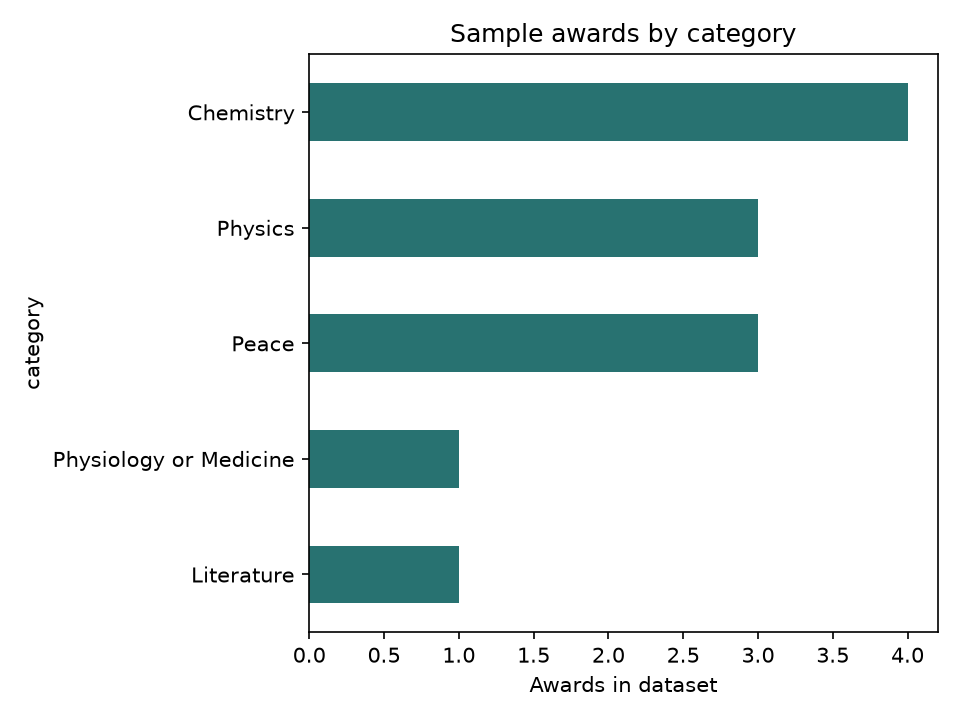

# Nobel Data Explorer

A small reproducible Pandas analysis of Nobel Prize categories, decades and gender representation. It includes a compact offline sample, a notebook, reusable analysis functions and exported charts.



## Run

```bash
python -m venv .venv
source .venv/bin/activate
pip install -r requirements.txt
python analysis.py
jupyter notebook notebooks/nobel_explorer.ipynb
```

`python download_data.py` optionally downloads a larger dataset from the official Nobel Prize API. Nobel Prize linked data is provided by Nobel Prize Outreach under CC BY 4.0; see [the official specification](https://data.nobelprize.org/specification/). Run tests with `pytest`.
